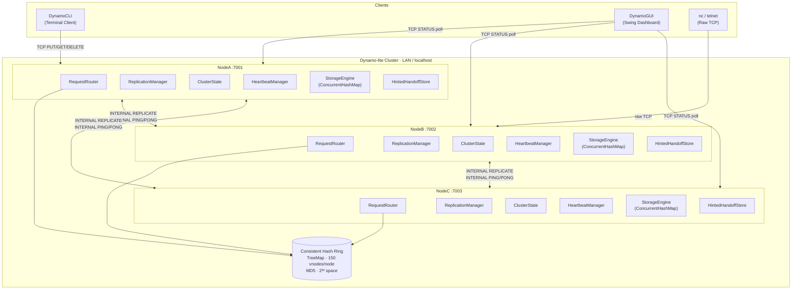

# System Architecture

```mermaid
graph TB
    subgraph Clients
        CLI["DynamoCLI<br/>(Terminal Client)"]
        GUI["DynamoGUI<br/>(Swing Dashboard)"]
        NC["nc / telnet<br/>(Raw TCP)"]
    end

    subgraph Cluster ["Dynamo-lite Cluster  ·  LAN / localhost"]
        direction LR

        subgraph NA["NodeA  :7001"]
            RA["RequestRouter"]
            RM_A["ReplicationManager"]
            CS_A["ClusterState"]
            HB_A["HeartbeatManager"]
            ST_A["StorageEngine<br/>(ConcurrentHashMap)"]
            HH_A["HintedHandoffStore"]
        end

        subgraph NB["NodeB  :7002"]
            RB["RequestRouter"]
            RM_B["ReplicationManager"]
            CS_B["ClusterState"]
            HB_B["HeartbeatManager"]
            ST_B["StorageEngine<br/>(ConcurrentHashMap)"]
            HH_B["HintedHandoffStore"]
        end

        subgraph NC2["NodeC  :7003"]
            RC["RequestRouter"]
            RM_C["ReplicationManager"]
            CS_C["ClusterState"]
            HB_C["HeartbeatManager"]
            ST_C["StorageEngine<br/>(ConcurrentHashMap)"]
            HH_C["HintedHandoffStore"]
        end

        RING[("Consistent Hash Ring<br/>TreeMap · 150 vnodes/node<br/>MD5 · 2³² space")]
    end

    CLI -->|TCP PUT/GET/DELETE| NA
    GUI -->|TCP STATUS poll| NA
    GUI -->|TCP STATUS poll| NB
    GUI -->|TCP STATUS poll| NC2
    NC -->|raw TCP| NB

    NA <-->|INTERNAL REPLICATE<br/>INTERNAL PING/PONG| NB
    NB <-->|INTERNAL REPLICATE<br/>INTERNAL PING/PONG| NC2
    NA <-->|INTERNAL REPLICATE<br/>INTERNAL PING/PONG| NC2

    RA --> RING
    RB --> RING
    RC --> RING
```
