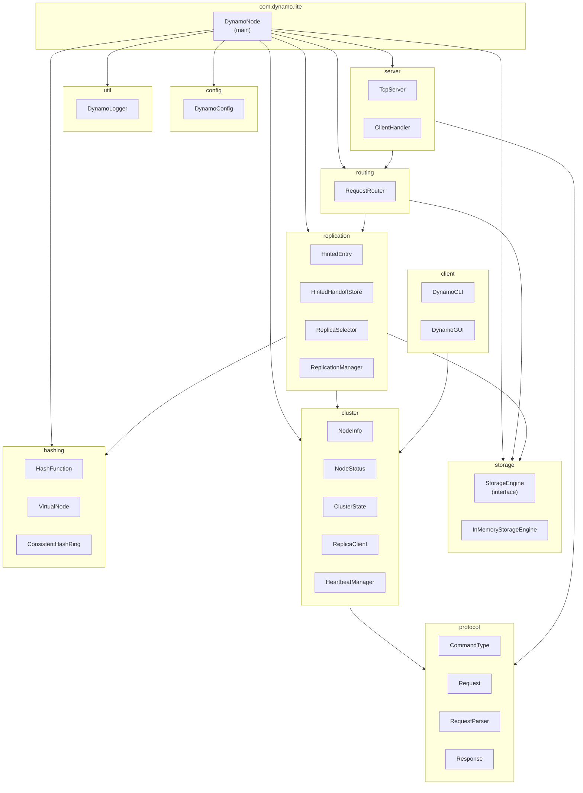

# Class Diagram

## Full System

```mermaid
classDiagram

    %% ─────────────────────────────────────────────
    %% ENTRY POINT
    %% ─────────────────────────────────────────────

    class DynamoNode {
        +main(String[] args)
    }

    %% ─────────────────────────────────────────────
    %% CONFIG
    %% ─────────────────────────────────────────────

    class DynamoConfig {
        -Properties props
        +DynamoConfig(String configFilePath)
        +getNodeId() String
        +getNodeHost() String
        +getNodePort() int
        +getPeers() List~NodeInfo~
        +getReplicationN() int
        +getWriteQuorum() int
        +getReadQuorum() int
        +getVnodeCount() int
        +getHeartbeatIntervalMs() int
        +getHeartbeatTimeoutMs() int
        +getHeartbeatMissThreshold() int
        +getClientThreadPoolSize() int
        +getClientIdleTimeoutMs() int
        +getReplicationTimeoutMs() int
    }

    %% ─────────────────────────────────────────────
    %% UTIL
    %% ─────────────────────────────────────────────

    class DynamoLogger {
        -String nodeId
        -DateTimeFormatter FMT
        +DynamoLogger(String nodeId)
        +info(String message)
        +warn(String message)
        +error(String message)
        -log(String level, String message)
    }

    %% ─────────────────────────────────────────────
    %% STORAGE
    %% ─────────────────────────────────────────────

    class StorageEngine {
        <<interface>>
        +put(String key, String value)
        +get(String key) Optional~String~
        +delete(String key) boolean
        +size() int
        +keys() Set~String~
    }

    class InMemoryStorageEngine {
        -ConcurrentHashMap~String,String~ store
        +put(String key, String value)
        +get(String key) Optional~String~
        +delete(String key) boolean
        +size() int
        +keys() Set~String~
    }

    %% ─────────────────────────────────────────────
    %% PROTOCOL
    %% ─────────────────────────────────────────────

    class CommandType {
        <<enumeration>>
        PUT
        GET
        DELETE
        STATUS
        PING
        INTERNAL_REPLICATE_PUT
        INTERNAL_REPLICATE_DELETE
        INTERNAL_REPLICATE_GET
        INTERNAL_PING
        INTERNAL_PONG
        INTERNAL_FORWARD_PUT
        INTERNAL_FORWARD_GET
        INTERNAL_HINT_PUT
        INTERNAL_HINT_FLUSH
        INTERNAL_JOIN
        INTERNAL_LEAVE
        INTERNAL_STATUS
        UNKNOWN
    }

    class Request {
        -CommandType type
        -String key
        -String value
        -boolean internal
        +Request(CommandType, String, String, boolean)
        +getType() CommandType
        +getKey() String
        +getValue() String
        +isInternal() boolean
    }

    class RequestParser {
        +parse(String line)$ Request
        -parseInternal(String line)$ Request
    }

    class Response {
        +ok()$ String
        +value(String v)$ String
        +notFound()$ String
        +pong()$ String
        +ack()$ String
        +error(String code)$ String
        +status(String json)$ String
    }

    %% ─────────────────────────────────────────────
    %% CLUSTER
    %% ─────────────────────────────────────────────

    class NodeInfo {
        -String nodeId
        -String host
        -int port
        +NodeInfo(String, String, int)
        +getNodeId() String
        +getHost() String
        +getPort() int
    }

    class NodeStatus {
        <<enumeration>>
        ALIVE
        SUSPECTED
        DOWN
    }

    class ClusterState {
        -ConcurrentHashMap~String,NodeStatus~ statuses
        -ConcurrentHashMap~String,AtomicInteger~ missCounters
        -ConcurrentHashMap~String,AtomicLong~ lastSeen
        -int missThreshold
        +ClusterState(int missThreshold)
        +addNode(String nodeId)
        +markAlive(String nodeId)
        +recordMiss(String nodeId)
        +isAlive(String nodeId) boolean
        +isDown(String nodeId) boolean
        +getStatus(String nodeId) NodeStatus
        +getAllStatuses() Map~String,NodeStatus~
    }

    class ReplicaClient {
        -int timeoutMs
        -DynamoLogger logger
        +ReplicaClient(int timeoutMs, DynamoLogger logger)
        +send(NodeInfo target, String command) Optional~String~
    }

    class HeartbeatManager {
        -String selfId
        -List~NodeInfo~ peers
        -ClusterState clusterState
        -ReplicaClient replicaClient
        -int intervalMs
        -DynamoLogger logger
        -ScheduledExecutorService scheduler
        +HeartbeatManager(String, List, ClusterState, ReplicaClient, int, DynamoLogger)
        +start()
        +stop()
        -pingAllPeers()
    }

    %% ─────────────────────────────────────────────
    %% HASHING
    %% ─────────────────────────────────────────────

    class HashFunction {
        +hash(String input)$ long
    }

    class VirtualNode {
        -String vnodeId
        -long position
        -NodeInfo physicalNode
        +VirtualNode(String, long, NodeInfo)
        +getVnodeId() String
        +getPosition() long
        +getPhysicalNode() NodeInfo
    }

    class ConsistentHashRing {
        -int VNODE_COUNT
        -TreeMap~Long,NodeInfo~ ring
        +ConsistentHashRing(List~NodeInfo~ nodes)
        +getCoordinator(String key) NodeInfo
        +getPreferenceList(String key, int n) List~NodeInfo~
        +printRing()
        -buildRing(List~NodeInfo~ nodes)
    }

    %% ─────────────────────────────────────────────
    %% REPLICATION
    %% ─────────────────────────────────────────────

    class HintedEntry {
        +String key
        +String value
        +String operation
        +long timestamp
        +HintedEntry(String, String, String)
    }

    class HintedHandoffStore {
        -ConcurrentHashMap~String,CopyOnWriteArrayList~ store
        -int MAX_HINTS
        -DynamoLogger logger
        +HintedHandoffStore(DynamoLogger logger)
        +add(String targetNodeId, HintedEntry entry)
        +flush(String targetNodeId, NodeInfo, ReplicaClient)
        +size(String targetNodeId) int
    }

    class ReplicaSelector {
        -ConsistentHashRing ring
        +ReplicaSelector(ConsistentHashRing ring)
        +selectReplicas(String key, int n) List~NodeInfo~
    }

    class ReplicationManager {
        -String selfId
        -StorageEngine storage
        -ConsistentHashRing ring
        -ClusterState clusterState
        -ReplicaClient replicaClient
        -HintedHandoffStore hintStore
        -int replicationN
        -int writeQuorum
        -int readQuorum
        -int timeoutMs
        -DynamoLogger logger
        -ExecutorService replicationPool
        +ReplicationManager(String, StorageEngine, ConsistentHashRing, ClusterState, ReplicaClient, HintedHandoffStore, int, int, int, int, DynamoLogger)
        +handlePut(String key, String value) String
        +handleGet(String key) String
        +handleDelete(String key) String
    }

    %% ─────────────────────────────────────────────
    %% ROUTING
    %% ─────────────────────────────────────────────

    class RequestRouter {
        -String selfId
        -StorageEngine storage
        -ReplicationManager replicationManager
        -DynamoLogger logger
        +RequestRouter(String, StorageEngine, ReplicationManager, DynamoLogger)
        +route(Request req) String
    }

    %% ─────────────────────────────────────────────
    %% SERVER
    %% ─────────────────────────────────────────────

    class TcpServer {
        -int port
        -RequestRouter router
        -DynamoLogger logger
        -ExecutorService pool
        -boolean running
        +TcpServer(int, RequestRouter, int, DynamoLogger)
        +run()
        +stop()
    }

    class ClientHandler {
        -Socket socket
        -RequestRouter router
        -DynamoLogger logger
        +ClientHandler(Socket, RequestRouter, DynamoLogger)
        +run()
    }

    %% ─────────────────────────────────────────────
    %% CLIENT
    %% ─────────────────────────────────────────────

    class DynamoCLI {
        -Socket socket
        -PrintWriter out
-BufferedReader in
        -String connectedTo
        +main(String[] args)$
        -run()
        -connect(String host, int port)
        -disconnect()
        -sendCommand(String cmd)
        -printHelp()
    }

    class DynamoGUI {
        -DefaultTableModel clusterModel
        -JTextArea logArea
        -JTextField keyField
        -JTextField valueField
        -JComboBox nodeSelector
        -JLabel statusBar
        -ScheduledExecutorService poller
        +main(String[] args)$
        -startPolling()
        -pollCluster()
        -queryNode(NodeDef node) String[]
        -sendCommand(String cmd)
        -executeAsync(String command)
        -log(String msg)
    }

    class NodeDef {
        +String id
        +String host
        +int port
    }

    %% ─────────────────────────────────────────────
    %% RELATIONSHIPS
    %% ─────────────────────────────────────────────

    %% Entry point wires everything
    DynamoNode ..> DynamoConfig : reads
    DynamoNode ..> DynamoLogger : creates
    DynamoNode ..> InMemoryStorageEngine : creates
    DynamoNode ..> ConsistentHashRing : creates
    DynamoNode ..> ClusterState : creates
    DynamoNode ..> ReplicaClient : creates
    DynamoNode ..> HintedHandoffStore : creates
    DynamoNode ..> ReplicationManager : creates
    DynamoNode ..> RequestRouter : creates
    DynamoNode ..> HeartbeatManager : creates
    DynamoNode ..> TcpServer : creates

    %% Storage
    InMemoryStorageEngine ..|> StorageEngine

    %% Protocol
    Request --> CommandType
    RequestParser ..> Request : produces
    RequestParser ..> CommandType : uses

    %% Cluster
    ClusterState --> NodeStatus
    ClusterState --> NodeInfo
    HeartbeatManager --> ClusterState : updates
    HeartbeatManager --> ReplicaClient : uses
    HeartbeatManager --> NodeInfo : pings

    %% Hashing
    ConsistentHashRing --> VirtualNode : builds from
    ConsistentHashRing --> NodeInfo : maps to
    ConsistentHashRing ..> HashFunction : uses
    VirtualNode --> NodeInfo : wraps
    ReplicaSelector --> ConsistentHashRing : delegates to

    %% Hinted handoff
    HintedHandoffStore --> HintedEntry : stores
    HintedHandoffStore ..> ReplicaClient : flushes via

    %% Replication
    ReplicationManager --> StorageEngine : reads/writes
    ReplicationManager --> ConsistentHashRing : ring lookup
    ReplicationManager --> ClusterState : checks node health
    ReplicationManager --> ReplicaClient : sends INTERNAL cmds
    ReplicationManager --> HintedHandoffStore : stores hints

    %% Routing
    RequestRouter --> ReplicationManager : delegates PUT/GET/DELETE
    RequestRouter --> StorageEngine : direct for INTERNAL cmds

    %% Server
    TcpServer --> RequestRouter : passes requests to
    TcpServer ..> ClientHandler : spawns per connection
    ClientHandler --> RequestRouter : routes every line
    ClientHandler ..> RequestParser : parses lines

    %% Client
    DynamoGUI --> NodeDef : polls each
    DynamoGUI ..> ReplicaClient : sends commands via TCP
    DynamoCLI ..> NodeInfo : connects to
```

---

## Package Summary

```mermaid
graph TD
    subgraph com.dynamo.lite
        DN["DynamoNode\n(main)"]
    end

    subgraph config
        DC["DynamoConfig"]
    end

    subgraph util
        DL["DynamoLogger"]
    end

    subgraph storage
        SE["StorageEngine\n(interface)"]
        IMSE["InMemoryStorageEngine"]
    end

    subgraph protocol
        CT["CommandType"]
        REQ["Request"]
        RP["RequestParser"]
        RES["Response"]
    end

    subgraph cluster
        NI["NodeInfo"]
        NS["NodeStatus"]
        CS["ClusterState"]
        RC["ReplicaClient"]
        HM["HeartbeatManager"]
    end

    subgraph hashing
        HF["HashFunction"]
        VN["VirtualNode"]
        CHR["ConsistentHashRing"]
    end

    subgraph replication
        HE["HintedEntry"]
        HHS["HintedHandoffStore"]
        RS["ReplicaSelector"]
        RM["ReplicationManager"]
    end

    subgraph routing
        RR["RequestRouter"]
    end

    subgraph server
        TS["TcpServer"]
        CH["ClientHandler"]
    end

    subgraph client
        CLI["DynamoCLI"]
        GUI["DynamoGUI"]
    end

    DN --> config
    DN --> util
    DN --> storage
    DN --> cluster
    DN --> hashing
    DN --> replication
    DN --> routing
    DN --> server

    server --> routing
    routing --> replication
    routing --> storage
    replication --> hashing
    replication --> cluster
    replication --> storage
    cluster --> protocol
    server --> protocol
    client --> cluster
```
