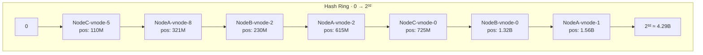
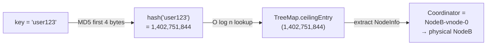
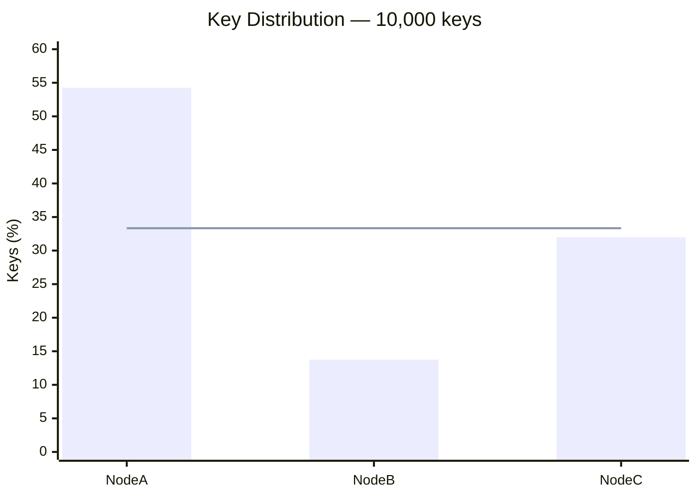

# Consistent Hashing

## Hash Ring

## Key Lookup (Clockwise Walk)

## Why Virtual Nodes

> **Top bars** = 1 virtual node per physical node (terrible balance).
> **Line** = ideal 33.3% target.
> At 150 virtual nodes per physical node, bars converge to the line.