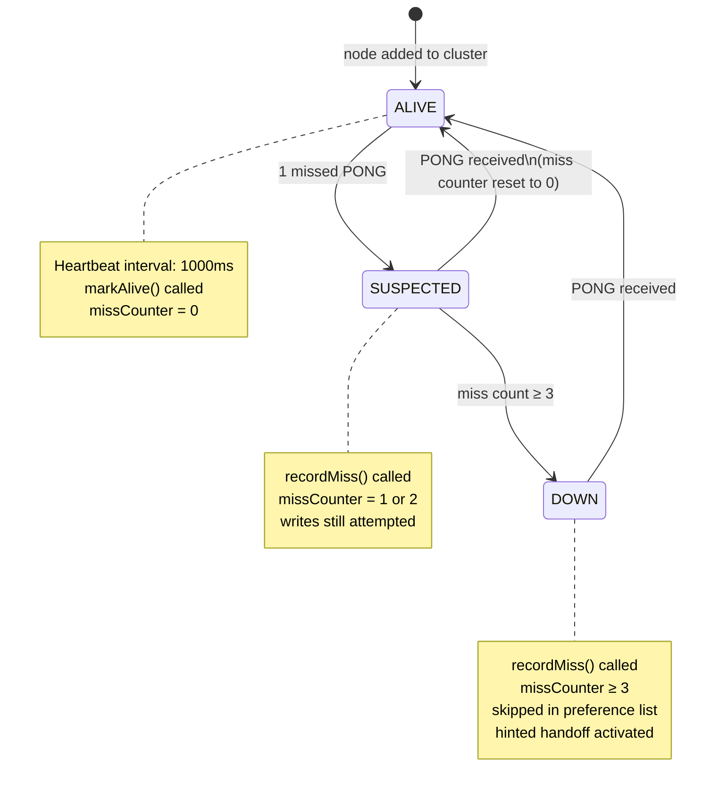
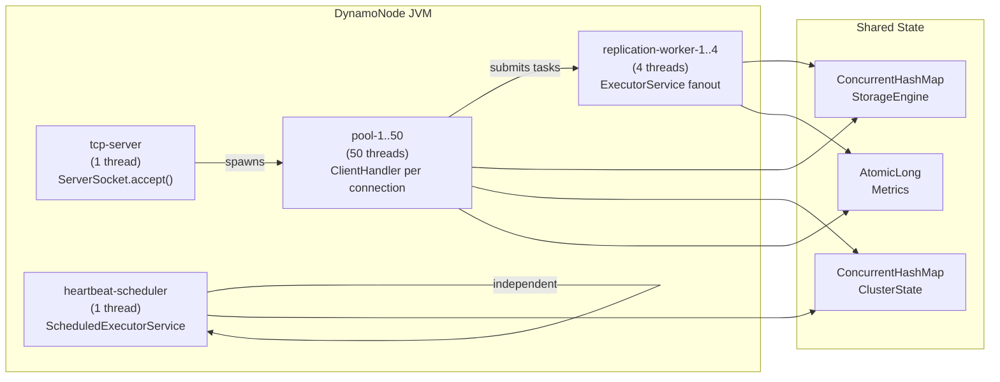

# Failure Detection

## Heartbeat State Machine

```mermaid
stateDiagram-v2
    [*] --> ALIVE : node added to cluster

    ALIVE --> SUSPECTED : 1 missed PONG
    SUSPECTED --> DOWN : miss count ≥ 3
    DOWN --> ALIVE : PONG received

    SUSPECTED --> ALIVE : PONG received\n(miss counter reset to 0)

    note right of ALIVE
        Heartbeat interval: 1000ms
        markAlive() called
        missCounter = 0
    end note

    note right of SUSPECTED
        recordMiss() called
        missCounter = 1 or 2
        writes still attempted
    end note

    note right of DOWN
        recordMiss() called
        missCounter ≥ 3
        skipped in preference list
        hinted handoff activated
    end note
```

## Heartbeat Timeline

```mermaid
gantt
    title Failure Detection Timeline  (NodeB crashes at t=0)
    dateFormat ss
    axisFormat %Ss

    section NodeA HeartbeatManager
    PING → PONG (normal)     :done,    p1, 00, 1s
    PING → timeout miss 1    :crit,    p2, 01, 1s
    PING → timeout miss 2    :crit,    p3, 02, 1s
    PING → timeout miss 3    :crit,    p4, 03, 1s
    NodeB marked DOWN        :milestone, m1, 04, 0s
    Hinted handoff active    :active,  hh, 04, 3s

    section NodeB
    Running normally         :done,    r1, 00, 1s
    CRASHED                  :crit,    cr, 01, 6s
```

## Threading Model

```mermaid
graph LR
    subgraph JVM ["DynamoNode JVM"]
        T1["tcp-server\n(1 thread)\nServerSocket.accept()"]
        T2["pool-1..50\n(50 threads)\nClientHandler per connection"]
        T3["replication-worker-1..4\n(4 threads)\nExecutorService fanout"]
        T4["heartbeat-scheduler\n(1 thread)\nScheduledExecutorService"]

        T1 -->|spawns| T2
        T2 -->|submits tasks| T3
        T4 -->|independent| T4
    end

    subgraph Shared State
        CM["ConcurrentHashMap\nStorageEngine"]
        CS["ConcurrentHashMap\nClusterState"]
        AL["AtomicLong\nMetrics"]
    end

    T2 --> CM
    T3 --> CM
    T2 --> CS
    T4 --> CS
    T2 --> AL
    T3 --> AL
```