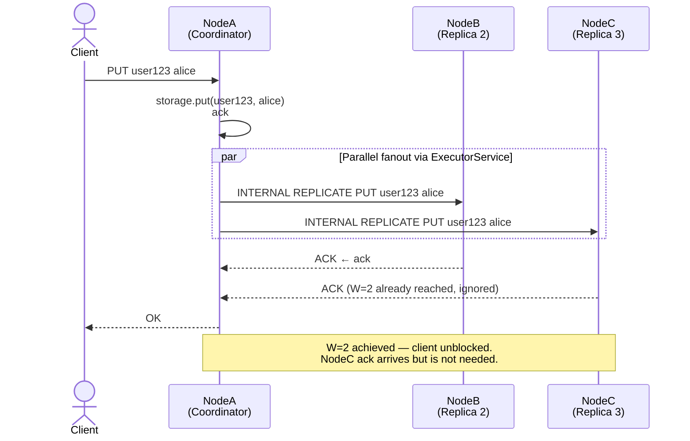
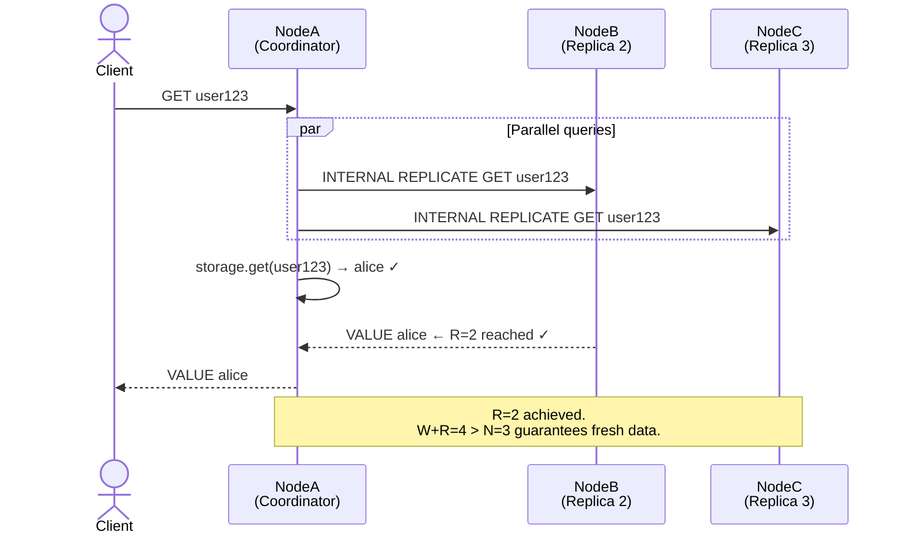
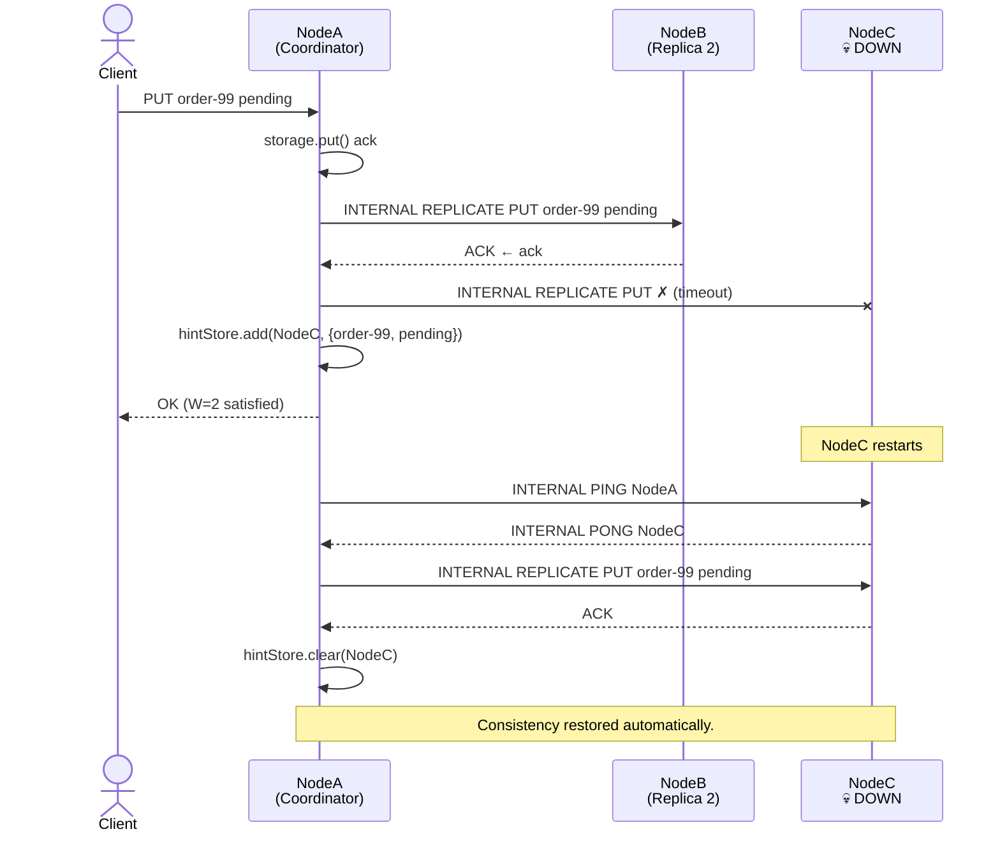

# Replication Flow

## Quorum Write  (N=3, W=2)

```mermaid
sequenceDiagram
    actor Client
    participant NA as NodeA<br/>(Coordinator)
    participant NB as NodeB<br/>(Replica 2)
    participant NC as NodeC<br/>(Replica 3)

    Client->>NA: PUT user123 alice

    NA->>NA: storage.put(user123, alice)<br/>ack #1 ✓

    par Parallel fanout via ExecutorService
        NA->>NB: INTERNAL REPLICATE PUT user123 alice
        NA->>NC: INTERNAL REPLICATE PUT user123 alice
    end

    NB-->>NA: ACK  ← ack #2 ✓
    NC-->>NA: ACK  (W=2 already reached, ignored)

    NA-->>Client: OK
    Note over NA,NC: W=2 achieved — client unblocked.<br/>NodeC ack arrives but is not needed.
```

## Quorum Read  (N=3, R=2)

```mermaid
sequenceDiagram
    actor Client
    participant NA as NodeA<br/>(Coordinator)
    participant NB as NodeB<br/>(Replica 2)
    participant NC as NodeC<br/>(Replica 3)

    Client->>NA: GET user123

    par Parallel queries
        NA->>NB: INTERNAL REPLICATE GET user123
        NA->>NC: INTERNAL REPLICATE GET user123
    end

    NA->>NA: storage.get(user123) → alice  ✓

    NB-->>NA: VALUE alice  ← R=2 reached ✓

    NA-->>Client: VALUE alice
    Note over NA,NC: R=2 achieved.<br/>W+R=4 > N=3 guarantees fresh data.
```

## Hinted Handoff  (NodeC is DOWN)

```mermaid
sequenceDiagram
    actor Client
    participant NA as NodeA<br/>(Coordinator)
    participant NB as NodeB<br/>(Replica 2)
    participant NC as NodeC<br/>💀 DOWN

    Client->>NA: PUT order-99 pending

    NA->>NA: storage.put() ack #1 ✓
    NA->>NB: INTERNAL REPLICATE PUT order-99 pending
    NB-->>NA: ACK  ← ack #2 ✓

    NA-xNC: INTERNAL REPLICATE PUT  ✗ (timeout)
    NA->>NA: hintStore.add(NodeC, {order-99, pending})

    NA-->>Client: OK  (W=2 satisfied)

    Note over NC: NodeC restarts

    NA->>NC: INTERNAL PING NodeA
    NC-->>NA: INTERNAL PONG NodeC

    NA->>NC: INTERNAL REPLICATE PUT order-99 pending
    NC-->>NA: ACK
    NA->>NA: hintStore.clear(NodeC)
    Note over NA,NC: Consistency restored automatically.
```